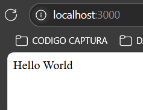

# Car CRUD

This project aims to develop a CRUD (Create, Read, Update, Delete) system for managing cars. The development will be done in three stages, each focusing on a different approach to learn and compare various development techniques:

1. **Spaghetti Code**: Initial implementation with structured code without object orientation.
2. **Object-Oriented Programming (OOP)**: Refactoring the code to apply object-oriented programming principles.
3. **Model-View-Controller (MVC)**: Final refactoring to structure the project with the MVC design pattern.

The project will use **PHP**, **JavaScript**, and **pure CSS** exclusively.

## Minimum Requirements

### Linux
- **PHP** 8.3
- **MySQL** or **MariaDB**

### Windows
- **Windows Subsystem for Linux (WSL)** with **Ubuntu 24.04**
- **PHP** 8.3
- **MySQL**

## Technologies Used
- **PHP**: Backend
- **JavaScript**: Frontend interactivity
- **CSS**: Styling

## Project Structure

### Stage 1: Spaghetti Code
- A single layer of code where functionalities are directly implemented in PHP files.
- Minimal separation of logic, structure, and style.

### Stage 2: Object-Oriented Programming (OOP)
- Introduction of classes to handle the application logic.
- Specific methods for each CRUD operation.

### Stage 3: Model-View-Controller (MVC)
- Separation of concerns:
  - **Model**: Data management and database operations.
  - **View**: Presentation of data to the user.
  - **Controller**: Handles application logic and communication between model and view.

## Initial Setup

### Linux
1. Install **PHP 8.3** and **MySQL** or **MariaDB**:
   ```bash
   sudo apt update
   sudo apt install --no-install-recommends php8.3
   sudo apt-get install -y php8.3-cli php8.3-common php8.3-mysql php8.3-zip php8.3-curl php8.3-bcmath
   curl -sS https://getcomposer.org/installer -o /tmp/composer-setup.php
   HASH=`curl -sS https://composer.github.io/installer.sig`
   php -r "if (hash_file('SHA384', '/tmp/composer-setup.php') === '$HASH') { echo 'Installer verified'; } else { echo 'Installer corrupt'; unlink('composer-setup.php'); } echo PHP_EOL;"
   ```
   The output should be **Installer verified**
   ```bash
   sudo php /tmp/composer-setup.php --install-dir=/usr/local/bin --filename=composer
   ```
   **Install mysql**
   ```bash
   mysql-server
   sudo apt install mysql-server
   sudo systemctl status mysql 
   ```
   If it's inactive
   ```bash
   sudo systemctl start mysql
   sudo mysql_secure_installation
   ```
   Root: y
   Password: Depends on you, in case it asks for a password just do it, in the other case you could login with:
   ```bash
   sudo mysql -u root
   ```
   Anonymus: y
   Root login: y
   Test db: y
   Reload privileges: y
   *Recommendations based on the article: https://linuxgenie.net/install-mysql-ubuntu-24-04/ *

2. Verify the versions:
   ```bash
   php -v
   mysql --version
   ```

### Windows
1. Install **WSL** and configure **Ubuntu 24.04**:
   - Follow the official WSL installation guide at [Microsoft Docs](https://learn.microsoft.com/en-us/windows/wsl/install).
   - Ubuntu
   
   

2. Within WSL, install **PHP 8.3** and **MySQL** as described in the Linux section.

### Test installation of php
1. Create a folder called MyFirstPhpFile
   ```bash
   mkdir MyFirstPhpFile 
   ```
2. Create a file inside called index.php
   ```bash
   cd MyFirstPhpFile
   nano index.php
   ```
   Copy paste the next text
   ```nano
   <?php 
      echo "Hello world";
   ```
   To get out of nano press `ctr+o` then press enter, and finally press `ctrl+x`
3. Open a development php server
   ```bash
   php -S localhost:3000 
   ```
4. On your browser navigate to `localhost:3000`, you should be seeing:



### Test installation of mysql
1. Enter to mysql
   ```bash
   sudo mysql -u root
   ```
2. Create a database for test, I'll be creating the project db since now
   ```sql
   create database autos;
   ```
3. As it's not recommended to use root user, create a user to manage the database
   ```sql
   -- 1. Create a new user
   CREATE USER 'crud_autos'@'localhost' IDENTIFIED BY 'passw0rd#';

   -- 2. Assign privileges on crud autos db
   GRANT ALL PRIVILEGES ON autos.* TO 'crud_autos'@'localhost';

   -- 3. Apply the realized changes
   FLUSH PRIVILEGES;

   ```
4. Test the new user
   1. First get out of mysql root session
   ```sql
      exit
   ```
   2. Login as the new user
   ```bash
   mysql -u crud_autos -p
   ```
   You will be ask to introduce the password
   3. Check if the user has the privileges to manipulate the database
   ```sql
   show databases;
   ```
   You should see `autos`
   ```sql
   use autos;
   CREATE TABLE test (
    PersonID int,
    LastName varchar(255),
    FirstName varchar(255),
    Address varchar(255),
    City varchar(255)
   );
   DROP TABLE test;
   ```
   If everything was `Query OK`, your installarion is fine 😊

### Test PHP & Mysql SetUp

   1. Create this on mysql with your personal user (NOT ROOT) on autos db

   ```sql
      CREATE TABLE `tbl_personal` (
      `id` int(11) NOT NULL,
      `nombres` varchar(50) NOT NULL,
      `apellidos` varchar(200) DEFAULT NULL,
      `profesion` varchar(150) DEFAULT NULL,
      `estado` varchar(100) DEFAULT NULL,
      `fregis` date DEFAULT NULL
      ) ENGINE=MyISAM DEFAULT CHARSET=utf8;


      INSERT INTO `tbl_personal` (`id`, `nombres`, `apellidos`, `profesion`, `estado`, `fregis`) VALUES
      (1, 'Zoila', 'Nina', 'Sistemas', 'Perú', '2019-08-20'),
      (2, 'Luis ', 'Fontis', 'Administrador', 'Argentina', '2019-08-19'),
      (3, 'Maria ', 'Cotrina', 'Sistemas', 'Ecuador', '2019-08-21'),
      (4, 'Jenifer ', 'Carrillo', 'Analista', 'Chile', '2019-08-21'),
      (5, 'Milagros ', 'Ferrer', 'Economista', 'Colombia', '2019-08-16');

      ALTER TABLE `tbl_personal`
      ADD PRIMARY KEY (`id`);


      ALTER TABLE `tbl_personal`
      MODIFY `id` int(11) NOT NULL AUTO_INCREMENT, AUTO_INCREMENT=13;COMMIT;
   ```
   2. Install php dependencies with composer
   ```bash
    composer require vlucas/phpdotenv
   ```
   Create a file called `.env`
   ```env
   host = 'localhost'
   db = 'changeme'
   user = 'changeme'
   password = 'changeme#'
   ```
   3. Inside your index.php add the following code
   ```php
   <?php
      require __DIR__ . '/vendor/autoload.php';
      $dotenv = Dotenv\Dotenv::createImmutable(__DIR__);
      $dotenv->safeLoad();
      $host = $_ENV['host'];
      $db = $_ENV['db'];
      $user = $_ENV['user'];
      $password = $_ENV['password'];
      $dsn = "mysql:host={$host};dbname={$db};charset=UTF8";
      try {
         $pdo = new PDO($dsn, $user, $password);
         $pdo->setAttribute(PDO::ATTR_ERRMODE, PDO::ERRMODE_EXCEPTION);

         if ($pdo) {
            echo "Connected to the $db database successfully!";
         }
      } catch (PDOException $e) {
         echo $e->getMessage();
      }
      echo "<br>";
      echo "<br>";
      $sql = "SELECT * FROM tbl_personal"; 
      $query = $pdo -> prepare($sql); 
      $query -> execute(); 
      $results = $query -> fetchAll(PDO::FETCH_OBJ); 

      if($query -> rowCount() > 0)   { 
      foreach($results as $result) { 
      echo "<tr>
      <td>".$result -> nombres."</td>
      <td>".$result -> apellidos."</td>
      <td>".$result -> profesion."</td>
      <td>".$result -> estado."</td>
      <td>".$result -> fregis."</td>
      </tr>";
      echo "<br>";

         }
      }


   ?>
   ```
   4. The output should look like this

   

#### Code explanation
   This code connects to a MySQL database using PDO (PHP Data Objects) and executes a query to retrieve all records from the `tbl_personal` table. The results are displayed in a basic HTML format.

   **Loading Environment Variables**
   ```php
   require __DIR__ . '/vendor/autoload.php';
   $dotenv = Dotenv\Dotenv::createImmutable(__DIR__);
   $dotenv->safeLoad();
   ```
   - Includes the `autoload.php` file generated by Composer, necessary for using installed dependencies.
   - Loads environment variables from a `.env` file located in the same directory as the script.
   - `safeLoad()` loads the environment variables safely, without throwing errors if the `.env` file is missing.


   **Database Configuration Retrieval**
   ```php
   $host = $_ENV['host'];
   $db = $_ENV['db'];
   $user = $_ENV['user'];
   $password = $_ENV['password'];
   ```
   - Retrieves database connection settings (host, database name, user, and password) from environment variables.


   **Database Connection**
   ```php
   $dsn = "mysql:host={$host};dbname={$db};charset=UTF8";
   try {
      $pdo = new PDO($dsn, $user, $password);
      $pdo->setAttribute(PDO::ATTR_ERRMODE, PDO::ERRMODE_EXCEPTION);
      if ($pdo) {
         echo "Connected to the $db database successfully!";
      }
   } catch (PDOException $e) {
      echo $e->getMessage();
   }
   ```
   - Creates a Data Source Name (DSN) with the connection parameters.
   - Attempts to establish a database connection using the `PDO` class:
   - If successful, it displays a message confirming the connection.
   - If an error occurs, it catches the exception (`PDOException`) and displays the error message.
   - Sets PDO's error mode to `ERRMODE_EXCEPTION` to handle errors in a controlled way.

   **Query and Data Retrieval**
   ```php
   $sql = "SELECT * FROM tbl_personal"; 
   $query = $pdo -> prepare($sql); 
   $query -> execute(); 
   $results = $query -> fetchAll(PDO::FETCH_OBJ);
   ```
   - Defines a SQL query to select all records from the `tbl_personal` table.
   - Prepares the SQL query with `prepare()` to enhance security against SQL injection.
   - Executes the query using `execute()`.
   - Fetches the results as an array of objects (`PDO::FETCH_OBJ`).

   **Displaying the Results**
   ```php
   if($query -> rowCount() > 0) { 
      foreach($results as $result) { 
         echo "<tr>
         <td>".$result->nombres."</td>
         <td>".$result->apellidos."</td>
         <td>".$result->profesion."</td>
         <td>".$result->estado."</td>
         <td>".$result->fregis."</td>
         </tr>";
         echo "<br>";
      }
   }
   ```
   - Checks if the query returned any records (`rowCount()`).
   - Iterates over the results and displays them as rows (`<tr>`) in an HTML table.
   - Each record displays values from the columns: `nombres`, `apellidos`, `profesion`, `estado`, and `fregis`.
