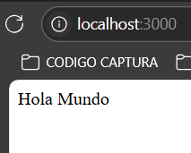
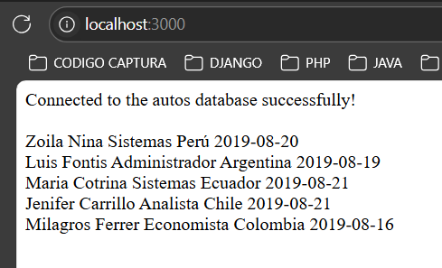

# Crud de Autos

Este proyecto tiene como objetivo desarrollar un CRUD (Crear, Leer, Actualizar, Eliminar) para gestionar autos. El desarrollo se realizará en tres etapas, cada una con un enfoque diferente para aprender y comparar distintas técnicas de desarrollo:

1. **Código espagueti**: Implementación inicial con código estructurado sin orientación a objetos.
2. **Orientación a objetos (OOP)**: Refactorización del código para aplicar principios de programación orientada a objetos.
3. **Modelo-Vista-Controlador (MVC)**: Refactorización final para estructurar el proyecto con el patrón de diseño MVC.

El proyecto utilizará exclusivamente **PHP**, **JavaScript** y **CSS puro**.

## Tecnologías utilizadas
- **PHP**: Backend
- **JavaScript**: Interactividad en el frontend
- **CSS**: Estilización
- **HTML**: Frontend
- **LucidChart**: Diseño del UML y diagrama relacional *Es de paga, su versión gratuita tiene varias limitaciones*
- **dbDiagram**: Diseño del diagrama entidad relación *Es de paga, su versión gratuita tiene varias limitaciones*

## Estructura del proyecto

### Etapa 1: [Código espagueti](spaguetti/readme.md)
- Una sola capa de código donde las funcionalidades estarán implementadas directamente en los archivos PHP.
- Separación mínima de lógica, estructura y estilo.

### Etapa 2: [Orientación a objetos (OOP)](poo/readme.md)
- Introducción de clases para manejar la lógica de la aplicación.
- Métodos específicos para cada operación del CRUD.

## Configuración inicial

### Prueba la instalación de php
1. Crea un folder llamado MiPrimerArchivoPhp
   ```bash
   mkdir MiPrimerArchivoPhp 
   ```
2. Dentro del folder crea un archivo llamado index.php
   ```bash
   cd MiPrimerArchivoPhp
   nano index.php
   ```
   Copia y pega el siguiente texto
   ```nano
   <?php 
      echo "Hola Mundo";
   ```
   Para salir de nano presiona `ctr+o` luego enter, y finalmente presiona `ctrl+x`
3. Inicia un server de desarrollo de php con tu ip, en este caso el server de la iMAC esta a 10.50.70.236 y el puerto con la siguiente fórmula 3000 + grupo*100 + numero_de_equipo
   ```bash
   php -S ip:puerto
   ```
4. En el browser navega a `ip:puerto`, debería estar viendo:



### Test de la configuración de PHP & Mysql

   1. Crea esto en mysql con tu usario (NO ROOT) en tu base de datos

   ```sql
      CREATE TABLE `tbl_personal` (
      `id` int(11) NOT NULL,
      `nombres` varchar(50) NOT NULL,
      `apellidos` varchar(200) DEFAULT NULL,
      `profesion` varchar(150) DEFAULT NULL,
      `estado` varchar(100) DEFAULT NULL,
      `fregis` date DEFAULT NULL
      ) ENGINE=MyISAM DEFAULT CHARSET=utf8;


      INSERT INTO `tbl_personal` (`id`, `nombres`, `apellidos`, `profesion`, `estado`, `fregis`) VALUES
      (1, 'Zoila', 'Nina', 'Sistemas', 'Perú', '2019-08-20'),
      (2, 'Luis ', 'Fontis', 'Administrador', 'Argentina', '2019-08-19'),
      (3, 'Maria ', 'Cotrina', 'Sistemas', 'Ecuador', '2019-08-21'),
      (4, 'Jenifer ', 'Carrillo', 'Analista', 'Chile', '2019-08-21'),
      (5, 'Milagros ', 'Ferrer', 'Economista', 'Colombia', '2019-08-16');

      ALTER TABLE `tbl_personal`
      ADD PRIMARY KEY (`id`);


      ALTER TABLE `tbl_personal`
      MODIFY `id` int(11) NOT NULL AUTO_INCREMENT, AUTO_INCREMENT=13;COMMIT;
   ```
   2. Instala las dependencias necesarias de php con composer
   ```bash
    composer require vlucas/phpdotenv
   ```
   Crea un archivo llamado `.env`
   ```env
   host = 'localhost'
   db = 'changeme'
   user = 'changeme'
   password = 'changeme#'
   ```
   3. Dentro de tu index.php agrega el siguiente código
   ```php
   <?php
      require __DIR__ . '/vendor/autoload.php';
      $dotenv = Dotenv\Dotenv::createImmutable(__DIR__);
      $dotenv->safeLoad();
      $host = $_ENV['host'];
      $db = $_ENV['db'];
      $user = $_ENV['user'];
      $password = $_ENV['password'];
      $dsn = "mysql:host={$host};dbname={$db};charset=UTF8";
      try {
         $pdo = new PDO($dsn, $user, $password);
         $pdo->setAttribute(PDO::ATTR_ERRMODE, PDO::ERRMODE_EXCEPTION);

         if ($pdo) {
            echo "Connected to the $db database successfully!";
         }
      } catch (PDOException $e) {
         echo $e->getMessage();
      }
      echo "<br>";
      echo "<br>";
      $sql = "SELECT * FROM tbl_personal"; 
      $query = $pdo -> prepare($sql); 
      $query -> execute(); 
      $results = $query -> fetchAll(PDO::FETCH_OBJ); 

      if($query -> rowCount() > 0)   { 
      foreach($results as $result) { 
      echo "<tr>
      <td>".$result -> nombres."</td>
      <td>".$result -> apellidos."</td>
      <td>".$result -> profesion."</td>
      <td>".$result -> estado."</td>
      <td>".$result -> fregis."</td>
      </tr>";
      echo "<br>";

         }
      }


   ?>
   ```
   4. Deberías de ver algo así

   
   
#### Explicación del código

---

## Descripción del Código
El código se conecta a una base de datos MySQL utilizando PDO (PHP Data Objects) y realiza una consulta para obtener todos los registros de la tabla `tbl_personal`. Los resultados se muestran en un formato HTML básico.

---

### Explicación por Secciones

#### **Carga de Variables de Entorno**
```php
require __DIR__ . '/vendor/autoload.php';
$dotenv = Dotenv\Dotenv::createImmutable(__DIR__);
$dotenv->safeLoad();
```
- Incluye el archivo `autoload.php` generado por Composer, necesario para utilizar las dependencias instaladas.
- Carga las variables de entorno desde un archivo `.env` ubicado en el mismo directorio que el script.
- `safeLoad()` carga las variables de entorno de forma segura, sin lanzar errores si el archivo `.env` no existe.

---

#### **Obtención de Configuración de la Base de Datos**
```php
$host = $_ENV['host'];
$db = $_ENV['db'];
$user = $_ENV['user'];
$password = $_ENV['password'];
```
- Obtiene las configuraciones de conexión a la base de datos (host, nombre de la base de datos, usuario y contraseña) desde las variables de entorno.

---

#### **Conexión a la Base de Datos**
```php
$dsn = "mysql:host={$host};dbname={$db};charset=UTF8";
try {
    $pdo = new PDO($dsn, $user, $password);
    $pdo->setAttribute(PDO::ATTR_ERRMODE, PDO::ERRMODE_EXCEPTION);

    if ($pdo) {
        echo "Connected to the $db database successfully!";
    }
} catch (PDOException $e) {
    echo $e->getMessage();
}
```
- Crea un Data Source Name (DSN) con los parámetros de conexión.
- Intenta establecer una conexión a la base de datos usando la clase `PDO`:
  - Si tiene éxito, muestra un mensaje confirmando la conexión.
  - En caso de error, captura la excepción (`PDOException`) y muestra el mensaje de error correspondiente.
- Establece el modo de error de PDO a `ERRMODE_EXCEPTION`, para manejar errores de manera controlada.

---

#### **Consulta y Visualización de Datos**
```php
$sql = "SELECT * FROM tbl_personal"; 
$query = $pdo -> prepare($sql); 
$query -> execute(); 
$results = $query -> fetchAll(PDO::FETCH_OBJ);
```
- Define una consulta SQL para seleccionar todos los registros de la tabla `tbl_personal`.
- Prepara la consulta SQL con `prepare()` para mejorar la seguridad contra inyecciones SQL.
- Ejecuta la consulta con `execute()`.
- Recupera los resultados como un array de objetos (`PDO::FETCH_OBJ`).

---

#### **Muestra los Resultados**
```php
if($query -> rowCount() > 0) { 
    foreach($results as $result) { 
        echo "<tr>
        <td>".$result->nombres."</td>
        <td>".$result->apellidos."</td>
        <td>".$result->profesion."</td>
        <td>".$result->estado."</td>
        <td>".$result->fregis."</td>
        </tr>";
        echo "<br>";
    }
}
```
- Comprueba si la consulta devolvió algún registro (`rowCount()`).
- Itera sobre los resultados y los muestra en formato de filas (`<tr>`) de una tabla HTML.
- Cada registro muestra los valores de las columnas: `nombres`, `apellidos`, `profesion`, `estado`, y `fregis`.

---
## Sigue con la primera implementación en [Código espagueti](spaguetti/readme.md)

## Sigue con la segunda implementación en [Código Orientación a objetos (OOP)](poo/readme.md)
