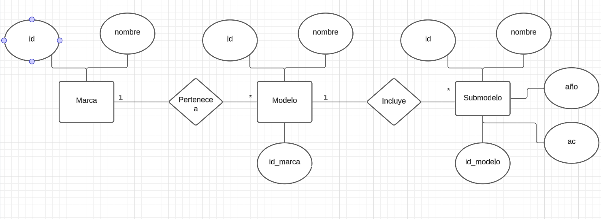
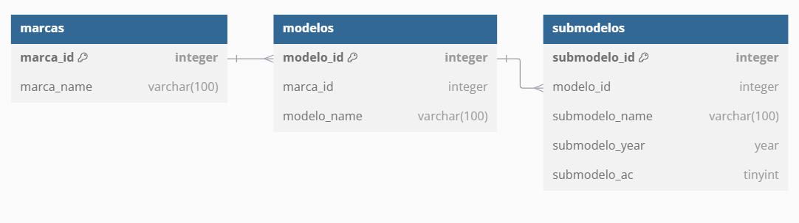

# Diseño de la base de datos

La situación que se presenta pide poder identificar marcas de autos, sus modelos y sus submodelos.

Por ejemplo:
- VW Jetta GLI 2019
- VW Jetta GLI 2018
- VW Jetta Trendline 2019

## Diagrama Relacional



## Diagrama Entidad Relación


El contenido actual de tu documento es claro y describe adecuadamente el diseño de la base de datos. Sin embargo, podrías mejorarlo añadiendo más detalles y explicaciones para hacerlo más completo y útil para los lectores. Aquí tienes algunas ideas sobre qué agregar:

---

### 1. **Descripción de los Diagramas**
- **Marca**: Contiene información sobre las marcas de autos.
- **Modelo**: Cada modelo pertenece a una marca y puede tener múltiples submodelos.
- **Submodelo**: Almacena detalles específicos como el nombre, el año y si tiene aire acondicionado.

---

### 2. **Definición de Atributos**

   ## Atributos de las Tablas

   ### Tabla Marca
   | Atributo  | Tipo      | Descripción                     |
   |-----------|-----------|---------------------------------|
   | marca_id  | INT       | Identificador único de la marca |
   | marca_nombre    | VARCHAR   | Nombre de la marca              |

   ### Tabla Modelo
   | Atributo  | Tipo      | Descripción                           |
   |-----------|-----------|---------------------------------------|
   | modelo_id | INT       | Identificador único del modelo        |
   | marca_id  | INT       | Relación con la tabla Marca           |
   | modelo_nombre    | VARCHAR   | Nombre del modelo                    |

   ### Tabla Submodelo
   | Atributo      | Tipo    | Descripción                                   |
   |---------------|---------|-----------------------------------------------|
   | submodelo_id  | INT     | Identificador único del submodelo             |
   | modelo_id     | INT     | Relación con la tabla Modelo                  |
   | submodelo_name| VARCHAR | Nombre del submodelo (e.g., GLI, Trendline)   |
   | submodelo_year| YEAR    | Año de fabricación                           |
   | submodelo_ac  | TINYINT | Indica si tiene aire acondicionado (1/0)     |

---

### 3. **Consultas de Ejemplo**
   ### Código para crear las tablas
   ```sql
    -- Crear tabla de marcas
    CREATE TABLE `marcas` (
        `marca_id` INT AUTO_INCREMENT PRIMARY KEY, -- Clave primaria con auto-incremento
        `marca_name` VARCHAR(100) NOT NULL        -- Nombre de la marca
    );

    -- Crear tabla de modelos
    CREATE TABLE `modelos` (
        `modelo_id` INT AUTO_INCREMENT PRIMARY KEY, -- Clave primaria con auto-incremento
        `marca_id` INT NOT NULL,                   -- Clave foránea que referencia a marcas
        `modelo_name` VARCHAR(100) NOT NULL,       -- Nombre del modelo
        CONSTRAINT `fk_modelos_marcas` FOREIGN KEY (`marca_id`) REFERENCES `marcas` (`marca_id`) ON DELETE CASCADE ON UPDATE CASCADE -- Relación con marcas
    );

    -- Crear tabla de submodelos
    CREATE TABLE `submodelos` (
        `submodelo_id` INT AUTO_INCREMENT PRIMARY KEY, -- Clave primaria con auto-incremento
        `modelo_id` INT NOT NULL,                     -- Clave foránea que referencia a modelos
        `submodelo_name` VARCHAR(100) NOT NULL,       -- Nombre del submodelo
        `submodelo_year` YEAR NOT NULL,               -- Año del submodelo
        `submodelo_ac` TINYINT(1) NOT NULL,           -- Indicador de aire acondicionado (1 para sí, 0 para no)
        CONSTRAINT `fk_submodelos_modelos` FOREIGN KEY (`modelo_id`) REFERENCES `modelos` (`modelo_id`) ON DELETE CASCADE ON UPDATE CASCADE -- Relación con modelos
    );

    -- Agregar índices para mejorar el rendimiento en las claves foráneas
    CREATE INDEX `idx_modelos_marca_id` ON `modelos` (`marca_id`);
    CREATE INDEX `idx_submodelos_modelo_id` ON `submodelos` (`modelo_id`);
    ```

   ### Insertar una Marca
   ```sql
   
   INSERT INTO Marca (nombre) VALUES ('Volkswagen');
   ```

   ### Insertar un Modelo
   ```sql
   INSERT INTO Modelo (id_marca, nombre) VALUES (1, 'Jetta');
   ```

   ### Insertar un Submodelo
   ```sql
   INSERT INTO Submodelo (id_modelo, nombre, año, ac) VALUES (1, 'GLI', 2019, 1);
   ```

   ### Consultar Submodelos de una Marca
   ```sql
   SELECT Marca.nombre AS Marca, Modelo.nombre AS Modelo, Submodelo.nombre AS Submodelo, Submodelo.año, Submodelo.ac
   FROM Submodelo
   JOIN Modelo ON Submodelo.id_modelo = Modelo.id_modelo
   JOIN Marca ON Modelo.id_marca = Marca.id_marca
   WHERE Marca.nombre = 'Volkswagen';
   ```

---

### 4. **Normas de Diseño**
   ## Normas de Normalización

   El diseño sigue la **Tercera Forma Normal (3NF)**:
   - Cada atributo depende únicamente de la clave primaria de su tabla.
   - No hay dependencias transitivas entre atributos.
   - Los datos están correctamente organizados para evitar redundancias.

---

### 5. **Casos de Uso**
   - **Crear**: Agregar una nueva marca, modelo o submodelo.
   - **Leer**: Consultar todos los submodelos de una marca.
   - **Actualizar**: Modificar un submodelo existente (e.g., cambiar el año o el estado del aire acondicionado).
   - **Eliminar**: Borrar un submodelo obsoleto.

   ## Casos de Uso

   ### Ejemplo: Agregar un nuevo Submodelo
   El usuario desea agregar un submodelo para el modelo Jetta de la marca Volkswagen:
   - **Marca**: Volkswagen
   - **Modelo**: Jetta
   - **Submodelo**: Highline
   - **Año**: 2020
   - **AC**: Sí

   Esto se realiza mediante un formulario en la interfaz gráfica que envía los datos al backend, donde se ejecuta una consulta SQL para insertar el submodelo en la tabla correspondiente.

---
